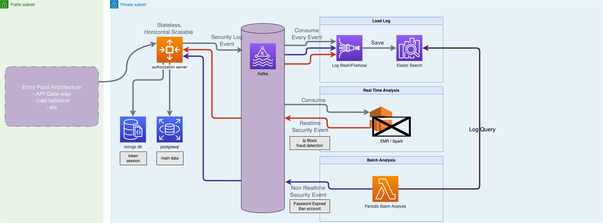
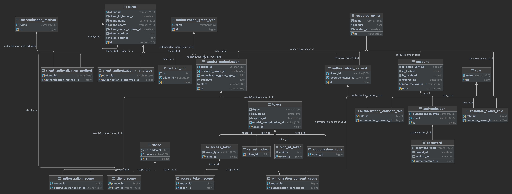

# Auth2.0 Authorization Server for SSO

## Introduction

이 프로젝트는 OAuth2.0을 이용한 인증서버를 구현한 프로젝트입니다.

자체 도메인에 통합 로그인 서비스를 제공하기 위해 만들어졌습니다.

## Server Architecture
Continuously updating (unfinished)

## Database Design

### 1. Postgresql

Database Diagram

Database Erd

### 2. MongoDB

## Details
1. [왜 WebFlux 를 채택하지 않았나? (Why didn't I adopt WebFlux?)](document/why_didn't_i_adopt_webflux.md)

## 사용된 기술
1. Spring Boot 3.0.0
2. jdk 17
3. jpa
4. postgresql
5. spring authorization server 1.0.3