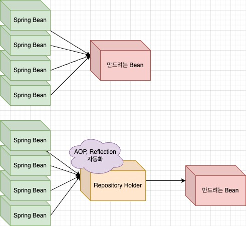

## 문제상황
openId 를 이용한 SSO 인증 서버를 만드는 중 엔티티가 매우 많이 늘어났다.
Spring Data Jpa를 사용했는데, 문제는 다음과 같았다.
- 엔티티당 레파지토리를 생성하다보니, 너무 많은 repository가 생성되었다.
- 의존성을 주입해줄 때 너무 많은 repository를 나열해서 주입하여야 했다.
```java
@Component
@RequiredArgsConstructor
public class JpaAuthorizationService implements OAuth2AuthorizationService {

    private final EntityManager em;

    private final ScopeRepository scopeRepository;
    private final OAuth2AuthorizationRepository authorizationRepository;
    private final AuthorizationGrantTypeRepository authorizationGrantTypeRepository;
    
    //...계속되는 repository들
```
생성자 주입을 사용한다고 하여도, 너무 많은 의존성이 발생했다.

또 @Configuration 과 @Bean을 활용해서 주입할때도, 
```java
    @Bean
    public RegisteredClientRepository registeredClientRepository() {
        return new JpaRegisteredClientService(clientRepository, scopeRepository, authenticationMethodRepository, authorizationGrantTypeRepository);
    }
```
너무 많은 의존성이 생겼고, 모두 반복되다보니, 가독성, 생산성, 유지보수 측면에서 좋지 못했다.

또 다른 문제는, 나는 좀 정적인 엔티티에 대해서는 캐싱을 적용하고 싶었다.
하지만 JPA의 2차 캐시가 아닌, spring 의 캐싱을 활용해서 메서드 레벨에 적용하고 싶었다. (이유는 검색하면 많이 나온다.)

하지만 그렇다고 각각 레파지토리에 캐싱 관련 코드를 덛붙이자니, 너무 하드코딩이 었다.

이러한 Too Much Repository문제는 흔히 발생한다. (내가 만든 용어다 ㅋㅋ,.,.)
## 문제를 해결하자
나의 기본 요구사항은 다음과 같았다.
- 레파지토리를 추가하더라도, 코드가 변경되더라도, 다른 코드의 변경이 없어야한다.
- 주입 받는 의존성의 갯수를 줄이자
- 추후 프록시를 통한 캐싱 적용이 가능하도록 설계하자.



그래서 다음과 같은 코드를 작성하였다.

```java

import lombok.RequiredArgsConstructor;
import org.springframework.aop.framework.AopProxyUtils;
import org.springframework.beans.BeansException;
import org.springframework.beans.factory.config.BeanPostProcessor;
import org.springframework.context.ApplicationContext;
import org.springframework.context.ApplicationListener;
import org.springframework.context.event.ContextRefreshedEvent;
import org.springframework.data.jpa.repository.JpaRepository;
import org.springframework.stereotype.Component;

import java.util.Arrays;
import java.util.Collections;
import java.util.HashMap;
import java.util.Map;

@Component
@RequiredArgsConstructor
public class RepositoryHolder implements BeanPostProcessor, ApplicationListener<ContextRefreshedEvent> {

    private ApplicationContext applicationContext;
    private boolean isInitialized = false;
    //읽기 전용으로, 제한된 메서드를 통해서만 외부에 노출되므로, HashMap을 사용하였습니다.
    private Map<Class<? extends JpaRepository<?,?>>, JpaRepository> repositories =
            new HashMap<>();
            
            
            

    @Override
    public Object postProcessAfterInitialization(Object bean, String beanName) throws BeansException {
        if (isInitialized) return bean; // 임의적인 호출을 방지하기 위해 초기화 이후에는 무시한다.

        // Bean 초기화 직후 실행될 코드
        if (bean instanceof JpaRepository<?,?> proxyRepository) {
            Class<?> userDefinedInterface = loadUserDefineInterface(proxyRepository);
            repositories.put((Class<? extends JpaRepository<?,?>>) userDefinedInterface, proxyRepository);
        }
        return bean;
    }

    @Override
    public void onApplicationEvent(ContextRefreshedEvent event) {
        if (isInitialized) return; // 임의적인 호출을 방지하기 위해 초기화 이후에는 무시한다.
        // Bean 초기화가 완료된 후 실행될 코드
        this.repositories = Collections.unmodifiableMap(repositories);
        this.isInitialized = true;
    }

    public <T extends JpaRepository<?,?>> T getRepository(Class<T> repositoryClass) {
        return Optional.ofNullable(repositories.get(repositoryClass))
                .map(repository -> (T) repository)
                .orElseThrow(() -> new IllegalArgumentException("can not find repository"));
    }

    private Class<?> loadUserDefineInterface(JpaRepository<?,?> proxyRepository) {
        //프록시에서 유저가 정의했던 인터페이스를 추출한다.
        Class<?>[] interfaces = AopProxyUtils.proxiedUserInterfaces(proxyRepository);
        Class<?> userDefinedInterface = Arrays.stream(interfaces)
                .filter(JpaRepository.class::isAssignableFrom)
                .findFirst()
                .orElseThrow();
        return userDefinedInterface;
    }

}
```
코드를 보면 이해되겠지만, BeanPostProcessor 를 사용해서, Bean이 initialize 될 때마다, 코드를 등록했습니다.
- 이 코드에서, 조건 체크를 하고(JpaRepository의 자손인지)
- Spring Data Jpa가 구현하기 전의, 우리가 정의한 인터페이스를 추출해서,
- map에 등록해줍니다.

인터페이스를 추출하는 과정은 reflection을 활용했습니다.

그 다음 ApplicationListener을 활용해서 빈 초기화가 완료된 다음 할 작업을 정의했습니다.

- 여기서 필드로 존재하는 Map은 HashMap이므로 ThreadSafe하지 않습니다.
스프링 빈은 싱글톤으로 관리되기 때문에, 이 map에 수정작업을 허용하면 안됩니다.
- 물론, private 필드이고, 오직 getter를 통해 제한된 호출만 가능하므로, 수정될 확률은 없지만, 그래서 reflection 같은 가능성이 있으므로

따라서 빈 초기화가 완료되고 나면 이벤트 리스너를 통해, 더이상 map에 수정작업을 하지 못하게, UnmodifiedMap으로 감싸주었습니다.

테스트 코드를 봅시다.
```java
import click.porito.commons.auth2authserver.domains.resource_owner.entity.static_entity.RoleEntity;
import click.porito.commons.auth2authserver.domains.resource_owner.repository.RoleRepository;
import jakarta.persistence.EntityManager;
import jakarta.persistence.PersistenceContext;
import org.junit.jupiter.api.DisplayName;
import org.junit.jupiter.api.Test;
import org.springframework.beans.factory.annotation.Autowired;
import org.springframework.boot.test.context.SpringBootTest;
import org.springframework.data.jpa.repository.JpaRepository;
import org.springframework.test.context.ActiveProfiles;
import org.springframework.transaction.annotation.Transactional;
import test_util.TestEntityFactory;

import java.lang.reflect.Field;
import java.util.Map;

import static org.junit.jupiter.api.Assertions.*;

@ActiveProfiles("test")
@DisplayName("RepositoryHolder 테스트")
@Transactional
@SpringBootTest
class RepositoryHolderTest {

    @Autowired
    RepositoryHolder repositoryHolder;

    @PersistenceContext
    EntityManager entityManager;


    @Test
    @DisplayName("RoleRepository 정상적으로 로드 후 메서드 호출")
    void loadRepository() {
        //given
        RoleEntity roleEntity = TestEntityFactory.getRoleEntity();
        entityManager.persist(roleEntity);

        //when
        RoleRepository repository = repositoryHolder.getRepository(RoleRepository.class);

        //then
        assertNotNull(repository);

        //call method
        RoleEntity result = repository.findFirstByNameIgnoreCase(roleEntity.getName())
                .orElseGet(() -> fail());

        //then
        assertNotNull(result);
        assertEquals(roleEntity.getName(), result.getName());


    }

    @Test
    @DisplayName("UnmodifiableMap으로 제대로 변환되었는지 확인")
    void unmodifiableMap() throws NoSuchFieldException, IllegalAccessException {
        //given
        Field repositories = RepositoryHolder.class.getDeclaredField("repositories");
        repositories.setAccessible(true);
        Map<Class<? extends JpaRepository>, JpaRepository> map = (Map<Class<? extends JpaRepository>, JpaRepository>) repositories.get(repositoryHolder);

        //when
        assertThrows( UnsupportedOperationException.class,() -> map.put(RoleRepository.class, null));
    }


}
```

매우 쉽게 호출이 이뤄지는 것을 볼 수 있습니다.
또한 저 Get Repository의 인자로는 `? extend JpaRepository`만 올 수 있으므로, JpaRepository가 아닌 다른 클래스를 실수로 넣었을 때 컴파일 수준에서 에러가 발생합니다.

또한 코드가 변경되거나 레파지토리를 추가하여도, Repository Holder의 코드를 변경할 필요없이 바로 호출하면 됩니다.

또 만약 특정 레파지토리에 대해 프록시를 적용시켜서 캐싱을 활용하고 싶다면, 위의 코드를 아주 약간만 변경하면 됩니다.

이런게 AOP의 매력이 아닌가 싶습니다.
(AOP 기술을 쓰진 않았지만, 횡단관점에서 코딩을 했으니까 AOP라고 써도 되지 않을까 싶긴한데,, 확실하진 않습니다. 뜻만 전달되길 바랍니다.)

## 키포인트
- BeanPostProcessor
- ApplicationListener

## 추가 정보
ApplicationContextAware 도 유용해보인다.
```java
public interface ApplicationContextAware extends Aware {

	/**
	 * Set the ApplicationContext that this object runs in.
	 * Normally this call will be used to initialize the object.
	 * <p>Invoked after population of normal bean properties but before an init callback such
	 * as {@link org.springframework.beans.factory.InitializingBean#afterPropertiesSet()}
	 * or a custom init-method. Invoked after {@link ResourceLoaderAware#setResourceLoader},
	 * {@link ApplicationEventPublisherAware#setApplicationEventPublisher} and
	 * {@link MessageSourceAware}, if applicable.
	 * @param applicationContext the ApplicationContext object to be used by this object
	 * @throws ApplicationContextException in case of context initialization errors
	 * @throws BeansException if thrown by application context methods
	 * @see org.springframework.beans.factory.BeanInitializationException
	 */
	void setApplicationContext(ApplicationContext applicationContext) throws BeansException;

}
```
InitializingBean 도
```java
public interface InitializingBean {

	/**
	 * Invoked by the containing {@code BeanFactory} after it has set all bean properties
	 * and satisfied {@link BeanFactoryAware}, {@code ApplicationContextAware} etc.
	 * <p>This method allows the bean instance to perform validation of its overall
	 * configuration and final initialization when all bean properties have been set.
	 * @throws Exception in the event of misconfiguration (such as failure to set an
	 * essential property) or if initialization fails for any other reason
	 */
	void afterPropertiesSet() throws Exception;
```

